# To See The World
Python script to display Strava activities on one map! Can be used to see everywhere you have traveled and everywhere you would still like to go!

The screenshot below, shows my map! [Click the link](https://cem8301.github.io/to-see-the-world/) to see how it works!
 

## Intentions:
I started a long term cycle tour in May 2023 and found other cyclists asking for route advice and friends back home asking to visualize where we had been. I also love maps and learned I could re-vamp a previous project ([all-of-the-trails](https://github.com/cem8301/all-of-the-trails)). With this script it costs me nothing and can be run completely off of my phone. I also have missed coding :smile:. Other intentions follow:

- Setup to display multiple athletes at once
- Include interesting metrics
- Simple
    - Possible to code without internet/ gather data with basic internet
    - Runs fast
    - Easy to pick back up. Easy for others to run

## Example Output

### Map Output
Below are screenshots of example output of features that have been added so far.

There is a selection tool in the top right. This enables you to change the background tiles. It also allows you to toggle athletes on/off.
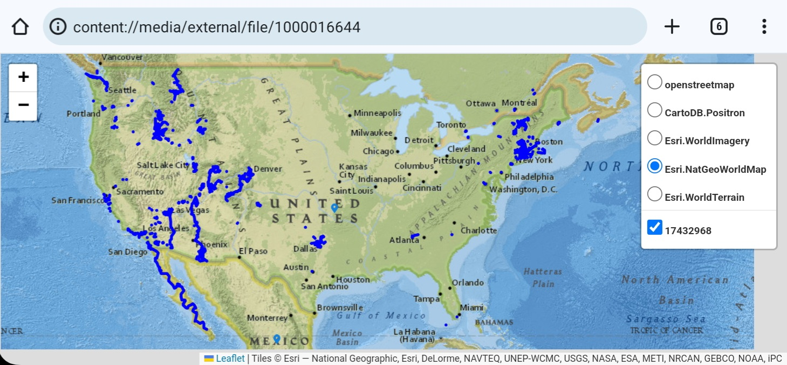

This map below shows output from two athletes. The toggle can help view activities better when there are multiple athletes who have ridden in the same places.
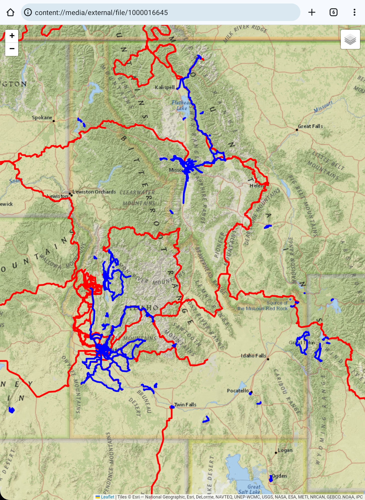

The activities are also interactive. Click on a line to show data from the activity. The Strava link will bring you directly to the recorded activity.
<p float="left">
  
   
</p>

Another way to view data is by clicking on the blue icon (one for each country visited). This popup will show a summary of all activities recorded in each country. Note, it is possible to change units (and many other things) in the [config.ini](https://github.com/cem8301/to-see-the-world/blob/main/src/to_see_the_world/config.ini) file.

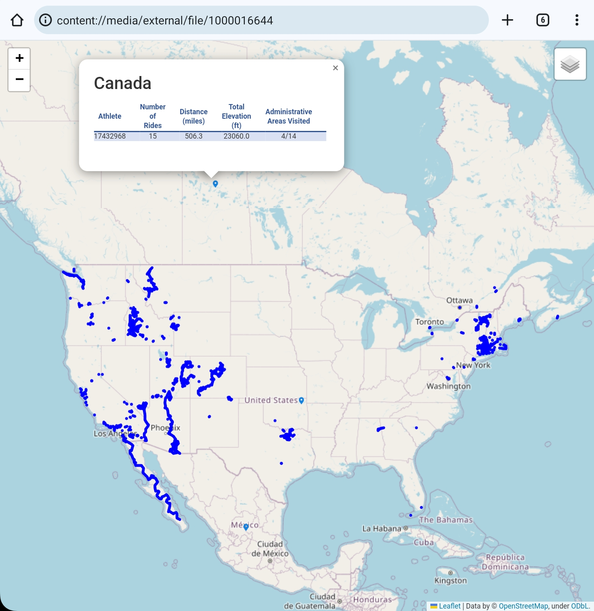

Here is a zoomed in version of my current tour. There is a feature on the bottom right to play a time lapse of your rides. A dot will jump between the start point of each of your rides to show progression over time. This feature works well for tours with daily rides or for people who ride from new places all of the time. If rides start from a single location the dot will blink there. Here is a time lapse of my tour from May 2023 to February 2025. It helps me to put distance into perspective. Long distances are more or less just covered in series of rides and they allow you to see so much!


### Summary Output
The user can also create a textual summary of a given timeframe. This timeframe can be defined by a start and/or end date or simply by the activity id number. An example of the textual summary can be seen below:

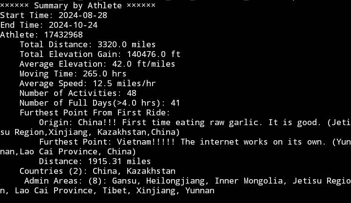

Another usecase came up- where other cyclists were asking for specific route data. The easiest way to share this is with .gpx files. The user can choose to output a recorded .gpx file (with post calculated elevation data) of any range of data. An example of a .gpx file opened in OsmAnd is shown below:

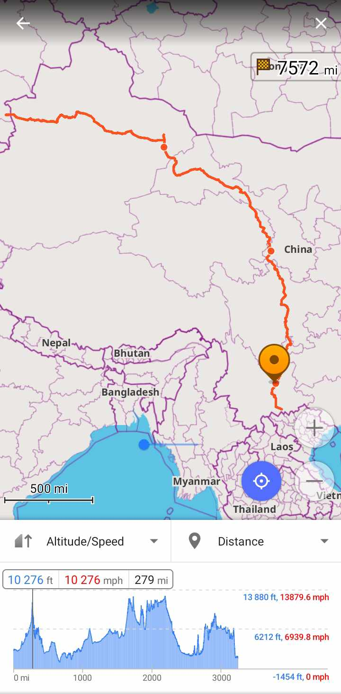

## Setup
**tldr; 30-40min for initial setup**
Get your own Strava API token, install a python IDE, download the code, setup your python environment, add Strava authentication strings

### Get your own Strava API token
The data for this project is currently all collected from the [Strava API](https://developers.strava.com/) which is publicly available. Individual users sign up for their own API token to run queries against any authenticated user. The tokens are rate limited (by every 15min and by day) and can only accept one user at a time (it is possible to allow for more users but tldr; thats alot of work). So everyone needs their own token! I will go through the process here.

To start, visit the [getting started guide](https://developers.strava.com/docs/getting-started/#:~:text=If%20you%20have%20not%20already,My%20API%20Application%E2%80%9D%20page%20now.). The gist is, if you dont already have a Strava account, create one. Then go [create](https://www.strava.com/settings/api) your API application. The **Authorization Callback Domain** is important. The other fields can be whatever you want. You can always edit them again later. My setup looks like this:
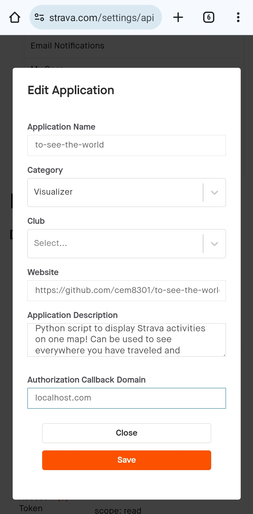

After my API application is created it looks like this. Note the Client ID and Client Secret. You will need those later. Awesome, part 1 is done!
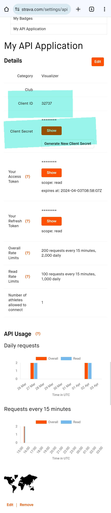

### Install a python IDE (Running on an Android phone)
The easiest option is to setup a python IDE. Download [Pydroid 3](https://play.google.com/store/apps/details?id=ru.iiec.pydroid3) from google play. 

### Download the git repo
You will need the code. Go to the top of this page, click the down arrow next to code, and hit download.
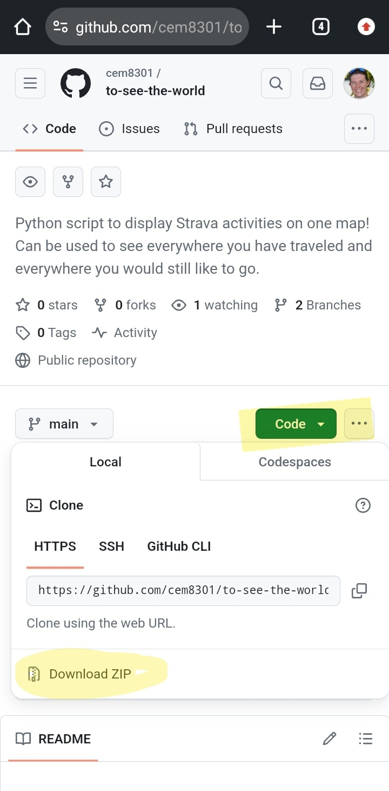
Put the code somewhere your new python IDE can read it. Open up you local  [to_see_the_world.py](https://github.com/cem8301/to-see-the-world/blob/main/src/to_see_the_world/to_see_the_world.py) in Pydroid. You will need this when running the code later.

Alternatively,
```
git clone ssh://git@github.com/cem8301/to-see-the-world.git
```

### Setup your python environment
You need to pip install all of the required dependencies. This [link](https://www.makeuseof.com/install-pydroid-android/) shows how to get these installed in Pydroid. The required dependencies are shown here:
```
flatten-dict
folium
gpxpy
ninja
numpy
pandas
Pillow
polyline
pretty-html-table
python-dateutil
pytz
pyclipper
requests
reverse-geocoder
scipy
stravalib
thefuzz
tzdata
wordcloud
xyzservices
```
Also here in the [requirements.text](https://github.com/cem8301/to-see-the-world/blob/main/requirements.txt) file.

Alternatively,
```
python -m pip install -r requirements.txt
```

### Add Strava authentication strings
Create a new file in the **src/to_see_the_world/** folder. Call it **secrets.ini**:
```
secrets.ini
```
Here is the base empty file:
```
[strava]
STRAVA_CLIENT_ID =
STRAVA_CLIENT_SECRET =
```
Here is the empty file. **Add the Client ID and Client Token** strings from the **Get your own Strava API token** section into the file.
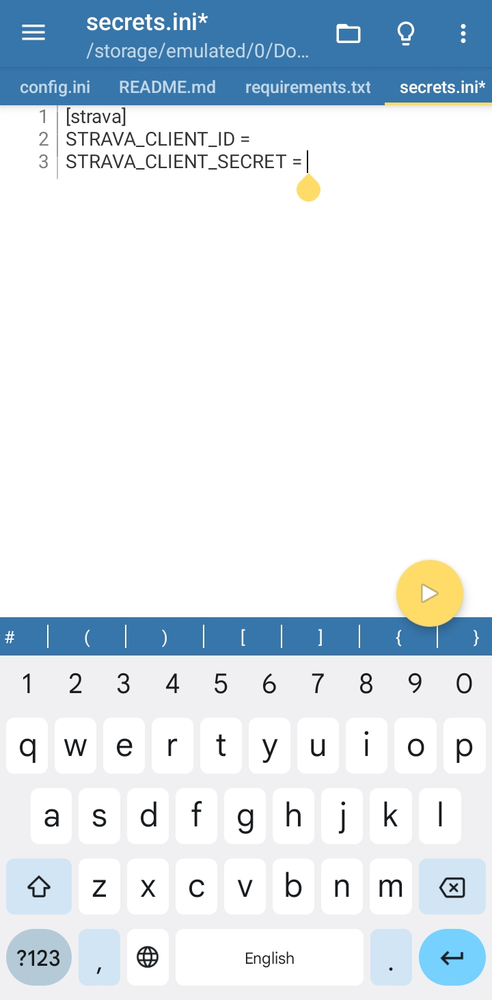

Once your environment is setup, you are ready to run!

## How to Authorize and Run
**tldr; 5-10min**
Create the Strava authorization link, gather the http link with code, run!, locate the output, notes for future runs

### Create the Strava authorization link
In order to gather data, the Strava API requires user authentication. First, replace the string **STRAVA_CLIENT_ID** in the link with your new id from the section above.

```https://www.strava.com/oauth/authorize?client_id=STRAVA_CLIENT_ID&response_type=code&redirect_uri=https://www.localhost.com/exchange_token&approval_prompt=force&scope=activity:read_all```

Paste this link in your browser to authenticate.
Your page should look like this:
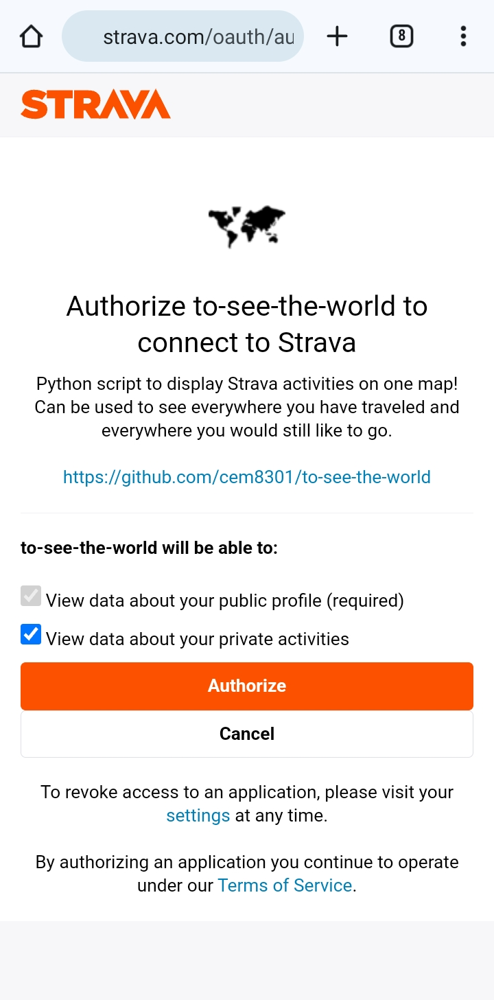

### Gather the http link with code
Keep the boxes checked (these permissions are important). Now click Authorize. This process will return a blank page (that is what we told it to do, we dont have a website). The return link is the important piece. Copy the link.
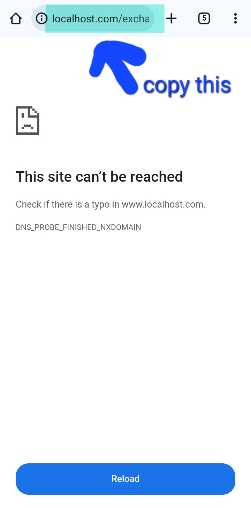

Take the link you coppied and paste it at the very bottom of your local **to_see_the_world.py** file. The script will split the string accordingly to use the generated code.
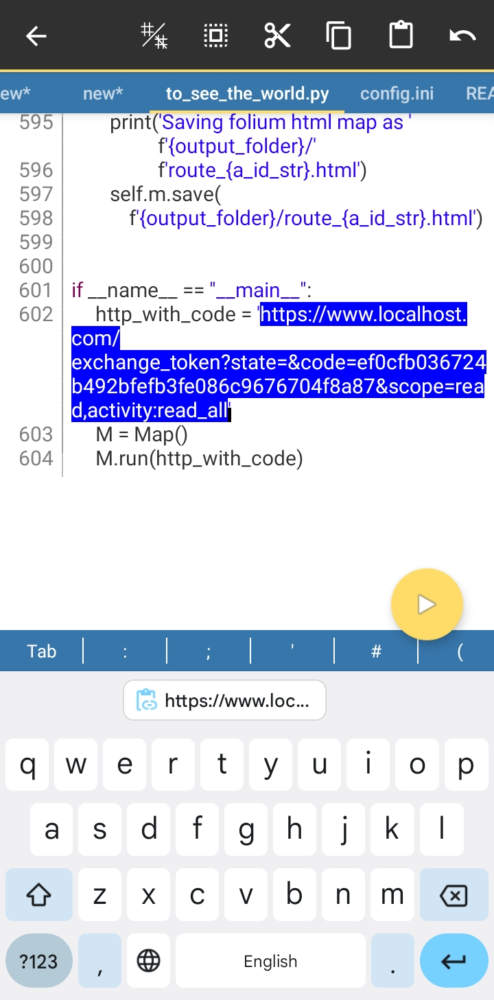

### Run!
At this point, you are ready to run the code. Hit the yellow arrow in the **to_see_the_world.py** file and wait. Watch the output and look for the line **Authorization code was successful**. Now we are connected with Strava and data collection can begin. Your output should look similar to this:
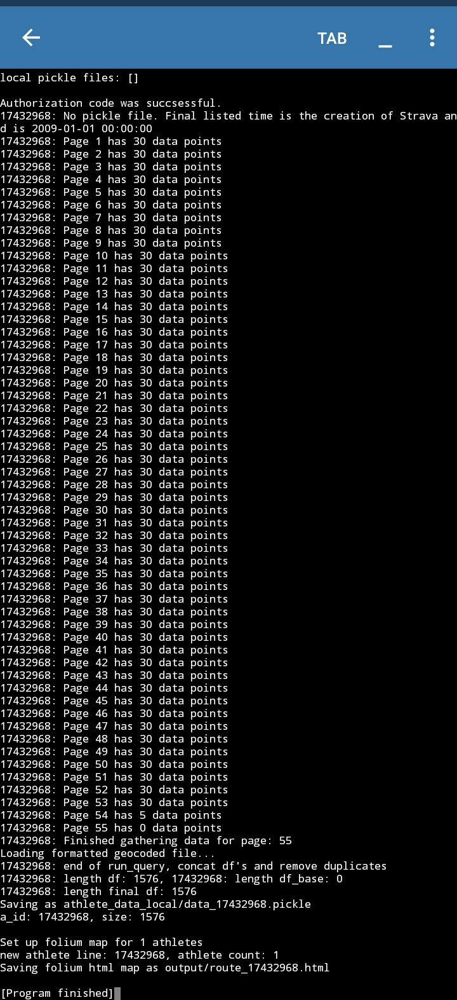

### Locate the output
When the code finishes two files will be output. One **athlete_data_local/data_17432968.pickle** file and one **output/route_17432968.html** file.
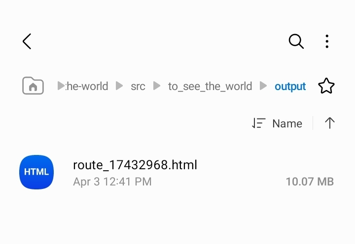
The html file is your map! Click on it and open in your web browser. That is it! You have a map and local data!

### Note for future runs
The pickle file stores the useful information gathered via the Strava API. This makes future runs much quicker. The code will first check for local pickle files, look for the date of the last entry, then (if authenticated) check Strava for any new data. This feature allows you to create a new map with out grabbing a new code. This also allows for overlaying other athletes data on one map (remember that only one athlete can be authenticated at a time). The map output will overlay any athlete pickle files to display on a single map. The html file will be named according with the athletes run.

## Ideas and Fixes Catalog!!
- [ ] Clean up get_geo and make the code its own repo
- [ ] Clean up supporting_data inputs. Data should be easily updateable and clear on the datasource
- [ ] Increase timelapse tracker top speed
- [ ] Have timelapse tracker skip inactive days, make sure the tracker is always visible, and make all riders tracker a different color
- [ ] Put country summary markers into feature groups and only show them when the rider is highlighted
- [ ] Option to hide country pointers. They do not always need to be displayed
- [ ] Multiple time lapse trackers show even when other riders are hidden, make trackers hide
- [ ] Distance vs time graph maybe as another html popup
- [ ] Add map function to only display bike certain bikes or activity types
- [ ] Option to add in other gpx files from sources other than Strava
- [ ] Add a link to create a google maps route layer
- [ ] Add elevation profiles to country summaries
- [ ] Update Strava authorization to remember secrets, so the user doesnt need to grant access every time
- [ ] Create cron (via phone? free place online?) to run map updates once a week
- [ ] Create summaries print out function. ie, distance, elevation, countries/regions and gif of map movement

## Resources
- Look at the [supporting_data](https://github.com/cem8301/to-see-the-world/blob/main/src%2Fto_see_the_world%2Fsupporting_data%2FREADME.md) folder to understand country boundaries and admin areas.
- Strava [swagger playground](https://developers.strava.com/playground/#/Activities/getLoggedInAthleteActivities). Shows how the queries work
-  Linux terminal on phone. I downloaded [termux](https://f-droid.org/packages/com.termux/) on my phone. Scroll down to Download APK. Allow Chrome to install files.
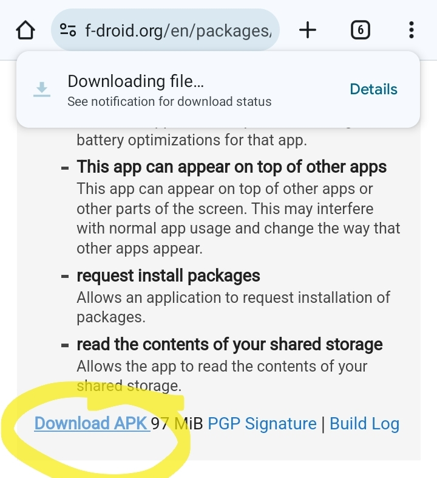
Now you have access to a linux terminal and can use git there. To setup git I followed this [guide](https://www.geeksforgeeks.org/how-to-install-git-on-termux/) (note, the google play version of termux is old. Use f-droid noted above).

## Ideas? Not very easy to run?
Please submit an issue above. Feedback is neat :smile:
