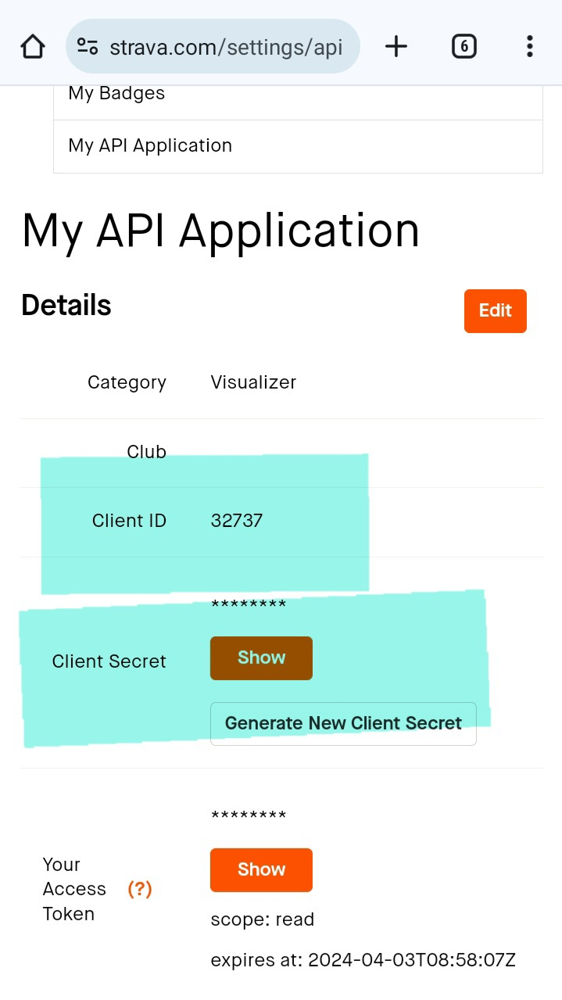

# To See The World
Python script to display Strava activities on one map! Can be used to see everywhere you have traveled and everywhere you would still like to go!

The screenshot below, shows my map! The file is local and I can view and interact with it in my browser. This is a link to the [real output](https://cem8301.github.io/to-see-the-world/). Click to see how it works!
 

## Intentions:
I started a long term cycle tour in May 2023 and found other cyclists asking for route advice and friends back home asking to visualize where we had been. I also love maps and learned I could re-vamp a previous project ([all-of-the-trails](https://github.com/cem8301/all-of-the-trails)). With this script it costs me nothing and can be run completely off of my phone. I also have missed coding :smile:. Other intentions follow:

- Setup to display multiple athletes at once
- Include interesting metrics
- Simple
    - Possible to code without internet/ gather data with basic internet
    - Runs fast
    - Easy to pick back up. Easy for others to run

## Example Output
Below are screenshots of example output of features that have been added so far.

There is a selection tool in the top right. This enables you to change the background tiles. It also allows you to toggle athletes on/off.


This map below shows output from two athletes. The toggle can help view activities better when there are multiple athletes who have ridden in the same places.


The activities are also interactive. Click on a line to show data from the activity. The Strava link will you bring you directly to the recorded activity.
<p float="left">
  
   
</p>

Another way to view data is by clicking on the blue icon (one for each country visited). This popup will show a summary of all activities recorded in each country. Note, it is possible to change units (and many other things) in the [config.ini](https://github.com/cem8301/to-see-the-world/blob/src/to_see_the_world/config.ini) file.


Finally, here is a zoomed in version of my current tour. It helps me to put distance into perspective. Long distances are more or less just covered in series of rides and they allow you to see so much! 

## Setup
tldr; Get your own Strava API token, setup a linux terminal, clone the git repo, setup your python environment, add Strava authentification strings

### Get your own Strava API token
The data for this project is currently all collected from the [Strava API](https://developers.strava.com/) which is publicly available. Individual users sign up for their own API token to run queries against any authenticated user. The tokens are rate limited (by every 15min and by day) and can only accept one user at a time (it is possible to allow for more users but tldr; thats alot of work). So everyone needs their own token! I will go through the process here.

To start, visit the [getting started guide](https://developers.strava.com/docs/getting-started/#:~:text=If%20you%20have%20not%20already,My%20API%20Application%E2%80%9D%20page%20now.). The gist is, if you dont already have a Strava account, create one. Then go [create](https://www.strava.com/settings/api) your API application. My setup looks like this:


After my API application is created it looks like this. Note the Client ID and Client Secret. You will need those later. Awesome, part 1 is done.


### Setup a linux terminal        
Next setup your linux terminal (Note, these are instructions for android phone user. A computer is a more normal place to code). I downloaded [termux](https://f-droid.org/packages/com.termux/) on my phone. Scroll down to Download APK. Allow Chrome to install files.


Now you have access to a linux terminal and can use git there. To setup git I followed this [guide](https://www.geeksforgeeks.org/how-to-install-git-on-termux/) (note, the google play version of termux is old. Use f-droid noted above).

### Clone the git repo
New users should [clone](https://docs.github.com/en/repositories/creating-and-managing-repositories/cloning-a-repository) or [fork](https://docs.github.com/en/pull-requests/collaborating-with-pull-requests/working-with-forks/fork-a-repo) this repo. Differences discussed [here](https://www.geeksforgeeks.org/difference-between-fork-and-clone-in-github/). If your not sure, use git clone. Navigate to where you would like the files to live and run:
```
git clone https://github.com/cem8301/to-see-the-world
```

### Setup your python environment
Next, find a way to run python. Two options are to install an android python IDE or install python on termux and run everything there. I have been using the python IDE, but I am writing lots of code. Still is likely easier to edit and run for new users. I will go through the two options here.

IDE--> The option I used, is downloading [pydroid 3](https://play.google.com/store/apps/details?id=ru.iiec.pydroid3) from google play. Here you can pip install all of the required dependencies. This [link](https://www.makeuseof.com/install-pydroid-android/) shows how it works. The requirements can be found in the [requirements.text](https://github.com/cem8301/to-see-the-world/blob/requirements.txt) file.

Termux--> To run everything on Termux you will need to install python and a text editor like [vim](https://www.freecodecamp.org/news/vim-beginners-guide/).
```
pkg install python vim
```
Next, setup your python environment. The code uses packages not part of core python that need to be installed. They are pinned and located in the requirements.txt](https://github.com/cem8301/to-see-the-world/blob/requirements.txt) file. Run the following command to install all packages. (IMPORTANT NOTE, its  WIP. There is some issue with installing numpy this way)
```
pip install -r requirements.txt
```

### Add Strava authentification strings
Finally create a secrets.ini in this [folder](https://github.com/cem8301/to-see-the-world/blob/src/to_see_the_world/) file but add your new STRAVA_CLIENT_ID and STRAVA_CLIENT_TOKEN strings to the file. This file must be added for authentication to work.


Once your environment is setup, you are ready to run!

## How to Authorize and Run
In order to gather data, the Strava API requires user authentification. Paste this link in your browser to authenticate. First, replace the string 'STRAVA_CLIENT_ID' in the link with your new id from the section above.
```https://www.strava.com/oauth/authorize?client_id=STRAVA_CLIENT_ID &response_type=code&redirect_uri=https://www.localhost.com/exchange_token&approval_prompt=force&scope=activity:read_all)```

Your page should look like this:


Keep the boxes checked (these permissions are important). Now click Authorize. This process will return a blank page (that is what we told it to do, we dont have a website). The return link is the important piece. Copy the link.


Take the link you coppied and paste it at the very bottom of your local [to_see_the_world.py](https://github.com/cem8301/to-see-the-world/blob/src/to_see_the_world/to_see_the_world.py) file. The script will split the string accordingly to use the generated code.


At this point, you are ready to run the code. Run the [to_see_the_world.py](https://github.com/cem8301/to-see-the-world/blob/src/to_see_the_world/to_see_the_world.py) file and wait. Watch the output and look for the line Authorization code was successful. Now we are connected with Strava and data collection can begin. Your output should look similar to this:


When the code finishes two files will be output. One athlete_data_local/data_17432968.pickle file and one output/route_17432968.html file.


The pickle file stores the useful information gathered via the Strava API. This makes future runs much quicker. The code will first check for local pickle files, look for the date of the last entry, then (if authenticated) check Strava for any new data. This feature allows you to create a new map with out grabbing a new code. This also allows for overlaying other athletes data on one map (remember that only one athlete can be authenticated at a time). The other file output is your map! Click on it and open in your web browser. That is it! You have a map and local data!

## Ideas and Fixes Catalog!!
- [ ] Distance vs time graph maybe as another html popup
- [ ] Include word cloud that summarizes ride names in each country
- [ ] Cleanup how country summaries are applied. My map shows that I have cycled in Georgia the country, when it was just Georgia that state
- [ ] Use admin type name to differntiate between states, provinces, etc. ie, US has 50 states, a federal district, minor outlying islands, and unicorperated territories. The number ofbadmin areas shows up as 60, which is confusing
- [ ] Specificly print out which admin areas have been visited. Means you can do a quick look, to name which exact admin areas you have visited
- [ ] Use the full set of coordinates to specify mileage in each admin area? Not sure if that will work
- [ ] Add a timeslider with a fun icon to fly around the map and show where you were at different times. Could be super neat if you have two people flying around on their own maps at once too. Leaving the [link](https://python-visualization.github.io/folium/latest/user_guide/plugins/timeslider_choropleth.html) to return to
- [ ] Looks like it is possible to highlight regions you have visited? Maybe too much, but maybe neat. Leaving the [link](https://medium.com/vahaninc/geospatial-data-analysis-using-python-libraries-4c0367e1e824) to return to
- [ ] Put country summary markers into feature groups and only show them when the rider is highlighted. I think that would look neater
- [ ] Add activity date to the line selection tooltip
- [ ] Add map function to only display bike certain bikes! or activity types
- [ ] Option to add in other gpx files from sources other than Strava. I have several tours that were not recorded.

## Resources
- World administrative areas [data source](https://hub.arcgis.com/datasets/4b316a570dc14f4a9daa2a88a7c6d419_0/explore?location=-0.192897%2C0.000000%2C1.89&showTable=true). Local file, mostly reflects that data
- [Country Centroids](https://developers.google.com/public-data/docs/canonical/countries_csv) data is from here
- Strava [swagger playground](https://developers.strava.com/playground/#/Activities/getLoggedInAthleteActivities). Shows how the queries work